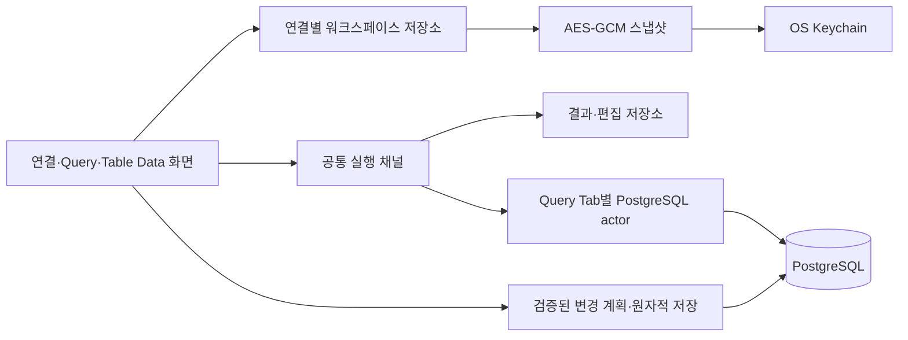

# 설계·구현 검토와 안정화 기록

검토·수정 기준: 2026-09-08. 범위는 macOS 데스크톱 PostgreSQL 클라이언트의 실제 구현이다.

## 목적과 설계 평가

DBPod의 목적은 SQL을 실행하고 여러 결과를 비교하면서, 사용자가 선택한 DB·행·값에만 편집을 적용하는 로컬 클라이언트다. 핵심 품질 기준은 데이터 정확성, Query Tab 세션 유지, 결과 보호, 자격 증명·SQL 초안의 안전한 보관이다.

React 기능별 분리, Rust application/adapter 경계, tagged DbValue, PostgreSQL 세션 actor, 실제 DB 통합 테스트는 이 목적에 맞는다. 기존 문제는 주로 비동기 실행의 완료 시점과 화면·결과·편집 버퍼의 수명이 일치하지 않는 지점에 있었다. 새 추상 계층을 추가하는 대신 상태 소유권과 공통 실행 경로를 수정했다.

## 확인한 문제와 수정

| 우선순위 | 문제 | 적용한 수정·회귀 증거 |
| --- | --- | --- |
| P1 | 연결 A의 React reducer 상태가 연결 B에 저장됨 | 연결별 외부 저장소 + 연결별 화면 수명. Router A→B→A 테스트 |
| P1 | dirty 결과 재실행으로 기존 편집이 새 PK를 가리킴 | 공통 result create에서 dirty/locked 거부, 기본 실행은 새 결과. UI·저장 테스트 |
| P1 | 실패한 트랜잭션에서 timeout SET이 ROLLBACK을 막음 | 실패 상태에서는 SET 생략, savepoint·AND CHAIN 복구. 실제 PG 테스트 |
| P1 | maxRows에서 stream을 버려 실패한 INSERT RETURNING을 성공 처리 | 행 보존만 중단하고 ReadyForQuery까지 drain. deferred FK 커밋 실패 테스트 |
| P1 | Query Result DELETE에 원본 값 검사가 없음 | Delete에도 originalValues 필수, xmin 부재 시 표시 값 검사. 동시 변경 행 삭제 방지 테스트 |
| P1 | cancel terminal이 실제 DB 취소보다 먼저 전달됨 | actor 전용 취소 연결, 서버 응답 확인 후 terminal. control mutex 점유·pg_sleep 테스트 |
| P1 | infinity·큰 날짜·최소 interval에서 decoder panic | 전체 날짜 범위 안전 변환, range·24:00 경계 보존. PG 왕복 테스트 |
| P1 | SQL 초안 평문 저장 | OS Keychain 키 + AES-256-GCM, nonce/AAD, 원자적 저장, 실패 시 원본 보존. 암호화 테스트 4개 |
| P2 | disconnect가 draft 삭제 후 스냅샷 저장 | 저장 성공 후 DB 종료·메모리 정리. 저장 실패는 UI에 표시하고 상태 보존 |
| P2 | invoke보다 빠른 terminal을 구독이 놓침 | invoke 전에 공통 실행 상태 설정, 채널에서 직접 완료 반영. 세 terminal 유형·background 완료 테스트 |
| P2 | 서버 값 사용 시 xmin 미갱신·다른 행 편집 위치 이동 | xmin 갱신, 충돌 draft 제거, 행 제거 후 인덱스 재배치. 저장 회귀 테스트 |
| P2 | TableData 화면 재사용으로 두 번째 테이블 조회 누락 | 탭별 view 수명·외부 페이지 상태. 독립 페이지 복원 테스트 |
| P2 | TableData 결과·편집·binary handle·preview 누수 | 소유 연결/탭에 따른 정리, result_release 연동. 연결 종료 후 예산 회수 테스트 |
| P2 | 행 수 제한만 있고 여러 결과의 byte 예산 없음 | 결과·연결·앱 공통 예산, prefix 보존, IPC 행 제한. 예산 공유·drop 테스트 |

명시적 COMMIT/COMMIT AND CHAIN/END의 지연 제약조건 실패 후에는 서버와 같은 Idle 상태로 복구하며, 실패한 트랜잭션에서 COMMIT이 수행한 rollback도 그대로 표시한다.

저장 트랜잭션에서 테이블을 잠그고 원본 OID·컬럼 정보를 다시 확인해, preview 이후 DDL로 교체된 테이블이나 컬럼에 변경이 적용되는 것도 차단한다.

추가로 preview 만료·소유권·메모리 제한, 편집 lock timeout, RAII rollback, 커밋 응답 유실 시 결과 불명확 오류, SQL 편집 가능성의 보수적 검증, TSV 리터럴 마커·잘못된 따옴표·초과 열 처리, 배열 내보내기·중복 JSON 열 차단, 일회용 비밀번호 연결, 프로필 편집 보호, native close의 저장 순서를 보완했다.

## 검증과 한계

실행 명령과 집계는 [구현 현황](../plan/progress.md)을 따른다. PostgreSQL 동작은 disposable PG17로, 프런트엔드 lifecycle은 실제 React Router·store·channel과 mock IPC를 연결해 검증했다. mock IPC 테스트는 네이티브 WebView·OS 권한·화면 렌더링 검증을 대체하지 않는다.

macOS release bundle은 생성했지만, Browser/Computer Use 연결이 없어 이번 실행에서 실제 GUI smoke는 수행하지 못했다. Windows/Linux/mobile, 배포 서명, vault 폴백, GTK3/glib 권고 처리는 출시 전에 추가 검증이 필요하다.

## 운영 시 복구

- 스냅샷 인증 실패·Keychain 오류가 나면 자동으로 빈 초안을 덮어쓰지 않는다. 열린 SQL을 별도로 보관하고 Keychain을 복구하거나 `workspace.json`과 대응 키를 함께 복원한 후 앱을 다시 실행한다.
- 기존 `workspace.json`은 첫 성공 로드에서 암호화한다. 과거 버전이 남긴 `workspace.json.tmp`·백업의 평문 데이터는 새 암호화 파일과 별개의 복구 자료다. 필요한 초안을 복구한 뒤 해당 파일도 정리해야 한다.
- `QUERY_OUTCOME_UNKNOWN` 또는 `COMMIT_OUTCOME_UNKNOWN`은 자동 재실행하지 않는다. DB에서 결과를 확인한 다음 사용자가 재시도한다.
- truncate된 결과의 편집·복사·export는 수신한 행만 대상으로 한다. SQL 실행 자체를 LIMIT로 다시 쓰지 않는다.
